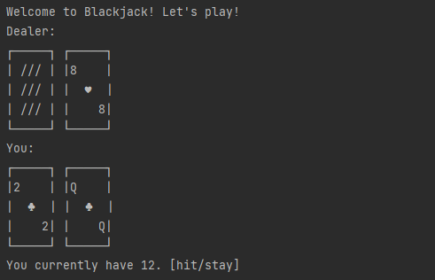

# Blackjack in Python
This is a simple game of Blackjack that was made entirely in Python. It has basic functionality such as not allowing duplicates of cards to appear, and winning on a Blackjack draw (getting 21 on your first two cards). The dealer will also hit on <16, and stay on >17
[](#Installation)

# Installation
Use git clone or download it directly on GitHub
```bash
git clone https://github.com/kevintr303/Python_Blackjack
```
This requires Python's Standard Library, which already come with most Python Installations

# Usage
Just run main.py for the game. Just make sure it's in the same folder as ``card.py``
```bash
python main.py
```

# Future updates
Whilst I can't guarantee I'll return to this project in the future, some possibly updates that can happen (that the game
doesn't include) is maybe a money system (where you can bet, double down, etc.), insurance if dealer has an Ace, and
other functionalities like splitting pairs.

# Information
This is a pretty simple game of blackjack that uses Python OOP (Object-Oriented-Programming). I made it for fun
and to get some more practice with using classes and objects. At the moment of writing this, I have
studied Python for 4-5 months, so I'm doing as many projects as I can to improve myself. :)
